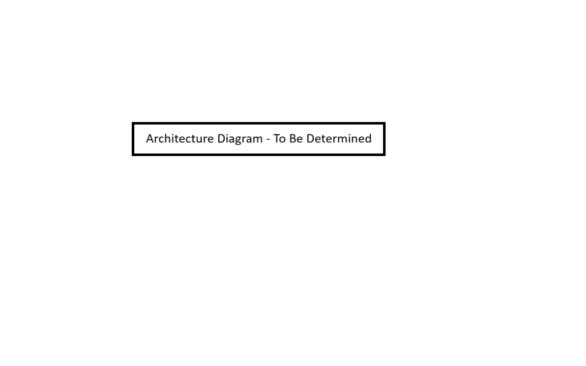
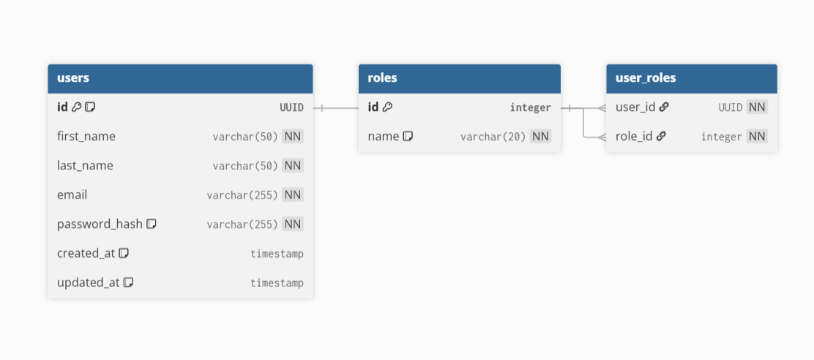

# 🚀 Unified Claims & Reimbursement Management Platform (UCRMP)

A full-stack, enterprise-grade microservices application designed to handle diverse claims with a focus on scalability, security, and automation.



## ✨ Vision

To create a unified, cloud-native platform for employees, administrators, and auditors that streamlines the entire claims lifecycle, from submission to reimbursement, using modern technologies and intelligent automation.

---

## 🛠️ Tech Stack & Architecture

| Layer               | Technologies                                                                   |
| ------------------- | ------------------------------------------------------------------------------ |
| **Frontend** | React, TypeScript, Vite, Redux Toolkit, Tailwind CSS                           |
| **Backend** | Java 17, Spring Boot 3, Spring Cloud                                           |
| **API Gateway** | Spring Cloud Gateway                                                           |
| **Microservices** | `auth-service`, `claim-service`                                                |
| **Database** | MySQL (Per-Service), Redis (for Caching)                                       |
| **Authentication** | Spring Security, JSON Web Tokens (JWT)                                         |
| **DevOps & Cloud** | Docker, GitHub Actions (CI/CD), AWS (EC2, RDS, S3)                             |
| **Monitoring** | Prometheus, Grafana                                                            |

---

## 🏛️ System Architecture

The system follows a microservices architecture. A React frontend communicates with a central **API Gateway**, which is the single entry point for all client requests. The gateway handles cross-cutting concerns like authentication validation, rate limiting, and routing to the appropriate downstream microservices. Each service has its own dedicated database to ensure loose coupling and independent scalability.

---

## ✅ Getting Started

### Prerequisites

-   Java 17+ (Amazon Corretto recommended)
-   Node.js 20+
-   Docker & Docker Compose
-   An IDE (IntelliJ IDEA or VS Code)
-   A local MySQL Server instance

### Local Setup

1.  **Clone the repository:**
    ```bash
    git clone [https://github.com/your-username/ucrmp-platform.git](https://github.com/your-username/ucrmp-platform.git)
    cd ucrmp-platform
    ```
2.  **Setup Database:**
    -   Using a MySQL client, create a new database: `CREATE DATABASE ucrmp_auth_db;`
    -   Update the database URL, username, and password in `backend/auth-service/src/main/resources/application.properties`.

3.  **Run the Auth Service:**
    ```bash
    cd backend/auth-service
    ./mvnw spring-boot:run
    ```
    The service will be available at `http://localhost:8081`.

4.  **Run the Frontend (once available):**
    ```bash
    cd frontend
    npm install
    npm run dev
    ```

---

## 🗂️ Database Schema (Auth Service)

The authentication service uses three core tables to manage user identity and access.



For more details, see the [ER Diagram explanation](#-er-diagram-the-data-blueprint).

---

## API Documentation

API contracts are documented using Swagger/OpenAPI. Once a service is running, its documentation can be accessed at:

-   **Auth Service Swagger UI:** `http://localhost:8081/swagger-ui/index.html`